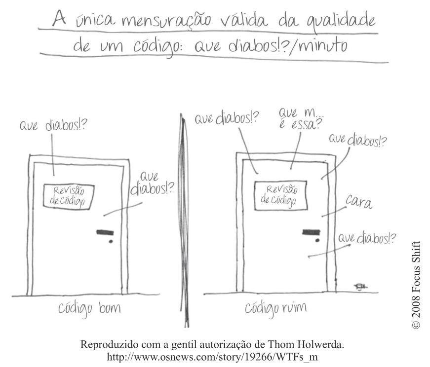

# 🧼 Capítulo 1 — Código Limpo

## 🎯 Objetivo da Aula

Entender o que é **código limpo**, por que ele é essencial e como desenvolver a mentalidade necessária para escrevê-lo no dia a dia.

---

## 💡 O que é Código?

Código é a forma como expressamos soluções para problemas usando uma linguagem de programação.

Mas nem todo código é igual.

👉 Existe uma grande diferença entre:
- código que **funciona**
- código que **pode ser entendido, mantido e evoluído**

---

## 🚨 O Problema do Código Ruim

Código ruim não surge por acaso. Ele normalmente aparece quando:

- estamos com pressa
- adiamos melhorias (“depois eu arrumo”)
- não seguimos padrões
- não nos preocupamos com legibilidade

### Consequências:

- dificuldade de manutenção
- aumento de bugs
- retrabalho constante
- queda de produtividade
- sistemas frágeis

Com o tempo, o código ruim **se acumula** e desacelera toda a equipe.

---

## 💸 O Custo do Código Confuso

Grande parte do tempo de desenvolvimento não é criando código novo, mas **entendendo código existente**.

Código confuso gera:

- mais tempo para entender
- mais erros ao modificar
- medo de alterar o sistema
- dependência de quem escreveu

👉 Resultado: o sistema evolui cada vez mais devagar.

---

## 🔁 O Mito do “Depois a gente refatora”

Um erro comum:

> “Vamos entregar rápido agora e depois a gente melhora”

Na prática, isso raramente acontece.

- novas demandas surgem
- prazos apertam
- o código ruim permanece

👉 Isso leva ao chamado **"Grande Replanejamento"**, onde o sistema precisa ser refeito.

---

## ⚖️ O Dilema do Desenvolvedor

Todo desenvolvedor enfrenta um dilema:

- entregar rápido  
ou  
- entregar bem feito  

Mas a realidade é:

> Código limpo **é mais rápido no longo prazo**

Código ruim cobra juros — e são altos.

---

## 🎨 Código Limpo é uma Arte?

Sim — mas também é disciplina.

Código limpo envolve:
- técnica
- prática
- atenção aos detalhes
- experiência

Não é algo que surge automaticamente.

---

## 🧼 O que é Código Limpo?

Não existe uma única definição, mas código limpo geralmente é:

- fácil de ler
- fácil de entender
- fácil de modificar
- bem organizado
- sem duplicação desnecessária
- com nomes claros
- com responsabilidades bem definidas

👉 Código limpo parece simples — mesmo quando resolve problemas complexos.

---

## 🧠 Mentalidade: Somos Autores

Uma ideia fundamental:

> **Código é escrito para humanos, não para máquinas**

A máquina só executa.

Quem precisa entender é:
- você no futuro
- sua equipe
- qualquer outro desenvolvedor

👉 Escrever código é como escrever um texto técnico.

---

## 🏕️ A Regra do Escoteiro

Uma das ideias mais importantes do livro:

> **"Deixe o código mais limpo do que você encontrou."**

Isso significa:
- melhorar pequenos detalhes
- corrigir nomes
- remover duplicações
- simplificar estruturas

👉 Pequenas melhorias contínuas evitam grandes problemas.

---

## 🧱 Princípios Fundamentais

Código limpo é construído com base em princípios como:

- clareza > inteligência
- simplicidade > complexidade
- legibilidade > otimização prematura
- organização > improviso

---

## 📌 Exemplo Simples

### ❌ Código ruim

~~~javascript
function calc(a, b, t){
    if(t == 1){
        return a + b
    } else if(t == 2){
        return a * b
    }
}
~~~