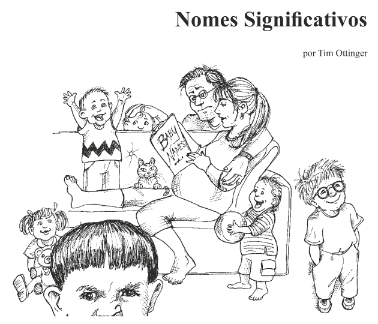

# 🏷️ Capítulo 2 — Nomes Significativos

## 🎯 Objetivo da Aula

Aprender a escolher nomes claros e expressivos para variáveis, funções e classes, tornando o código mais legível e fácil de manter.

---

## 💡 Por que nomes são tão importantes?

Dar nomes é uma das atividades mais frequentes no desenvolvimento de software.

E também uma das mais subestimadas.

👉 Um bom nome pode eliminar a necessidade de comentários.

👉 Um nome ruim pode tornar o código impossível de entender.

---

## 🧠 Código é Comunicação

Código não é apenas instrução para máquina — é comunicação entre pessoas.

> **Quem lê seu código precisa entender rapidamente o que está acontecendo.**

Nomes ruins geram:
- confusão
- interpretação errada
- aumento de bugs
- dificuldade de manutenção

---

## 🔍 Use nomes que revelem o propósito

O nome deve responder:

👉 **“O que essa variável/função representa?”**

---

### ❌ Exemplo ruim

~~~javascript
let d;
~~~

O que é `d`? Dias? Dados? Dinheiro?

---

### ✅ Exemplo melhor

~~~javascript
let diasDesdeCriacao;
~~~

Agora o propósito está claro.

---

## 🚫 Evite informações enganosas

Não use nomes que confundem ou sugerem algo errado.

---

### ❌ Exemplo

~~~javascript
let listaDeUsuarios = {};
~~~

O nome sugere uma lista, mas é um objeto.

---

### ✅ Melhor

~~~javascript
let usuariosPorId = {};
~~~

---

## ⚖️ Faça distinções significativas

Evite nomes que diferem apenas por pequenos detalhes.

---

### ❌ Exemplo

~~~javascript
let produto;
let produtoData;
let produtoInfo;
~~~

Diferenças vagas e pouco úteis.

---

### ✅ Melhor

~~~javascript
let produto;
let precoDoProduto;
let descricaoDoProduto;
~~~

---

## 🗣️ Use nomes pronunciáveis

Se você não consegue falar o nome, ele não é bom.

---

### ❌ Exemplo

~~~javascript
let xzqUsr;
~~~

---

### ✅ Melhor

~~~javascript
let usuarioAtivo;
~~~

👉 Código também é usado em discussões de equipe.

---

## 🔎 Use nomes pesquisáveis

Evite nomes muito curtos ou genéricos.

---

### ❌ Exemplo

~~~javascript
let x = 10;
~~~

Difícil de buscar no projeto.

---

### ✅ Melhor

~~~javascript
let limiteMaximoDeTentativas = 10;
~~~

---

## 🚫 Evite codificações

Não use prefixos ou códigos desnecessários.

---

### ❌ Exemplo (notação húngara)

~~~javascript
let strNome;
let intIdade;
~~~

---

### ✅ Melhor

~~~javascript
let nome;
let idade;
~~~

---

## 🧠 Evite mapeamento mental

O leitor não deve precisar “traduzir” nomes.

---

### ❌ Exemplo

~~~javascript
let l;
~~~

Você sabe que é uma lista — mas ninguém mais sabe.

---

### ✅ Melhor

~~~javascript
let listaDePedidos;
~~~

---

## 🧱 Nomes de Classes

Classes devem ser substantivos.

---

### ❌ Exemplo

~~~javascript
class GerenciarUsuario {}
~~~

---

### ✅ Melhor

~~~javascript
class UsuarioService {}
~~~

---

## ⚙️ Nomes de Métodos/Funções

Funções devem ser verbos.

---

### ❌ Exemplo

~~~javascript
function usuario() {}
~~~

---

### ✅ Melhor

~~~javascript
function obterUsuario() {}
~~~

---

## 🚫 Não seja “espertinho”

Evite trocadilhos ou nomes “criativos demais”.

---

### ❌ Exemplo

~~~javascript
function matarProcesso() {}
~~~

---

### ✅ Melhor

~~~javascript
function encerrarProcesso() {}
~~~

---

## 🎯 Use uma palavra por conceito

Evite usar nomes diferentes para a mesma ideia.

---

### ❌ Exemplo

~~~javascript
getUsuario();
fetchUsuario();
retrieveUsuario();
~~~

---

### ✅ Melhor

~~~javascript
getUsuario();
getPedido();
getProduto();
~~~

👉 Consistência é fundamental.

---

## 🚫 Não use trocadilhos

A mesma palavra não deve significar coisas diferentes.

---

### ❌ Exemplo

~~~javascript
addItem(); // adiciona
addItem(); // soma
~~~

---

### ✅ Melhor

~~~javascript
adicionarItem();
somarItem();
~~~

---

## 🌍 Use nomes do domínio

Sempre que possível, use termos do negócio.

---

### Exemplo

~~~javascript
let cliente;
let pedido;
let fatura;
~~~

👉 Isso aproxima o código da realidade do problema.

---

## 🧩 Adicione contexto significativo

Às vezes o nome precisa de contexto para fazer sentido.

---

### ❌ Exemplo

~~~javascript
let numero;
~~~

---

### ✅ Melhor

~~~javascript
let numeroDeTelefone;
~~~

---

## ⚠️ Evite contexto desnecessário

Não repita informação que já está clara.

---

### ❌ Exemplo

~~~javascript
class UsuarioData {
    let usuarioNome;
}
~~~

---

### ✅ Melhor

~~~javascript
class Usuario {
    let nome;
}
~~~

---

# 🏷️ EXEMPLOS — Nomes Significativos (Identificadores)

## 🧠 Regra de Ouro

> **Se você precisa de comentário para explicar um nome, o nome está errado.**

---

## 🔍 Exemplo Real — Código Difícil de Entender

~~~javascript
function process(a, b){
    let x = a * b;
    if(x > 100){
        return true;
    }
    return false;
}
~~~

### 🤯 Problemas:

- `a`, `b`, `x` → sem significado
- `process` → genérico demais
- não sabemos o contexto do cálculo

---

## ✅ Refatoração

~~~javascript
function valorTotalExcedeLimite(precoUnitario, quantidade){
    let valorTotal = precoUnitario * quantidade;
    return valorTotal > 100;
}
~~~

### 💡 Melhorias:

- nomes explicam o domínio
- intenção clara
- código autoexplicativo

---

## 🎓 Erros Clássicos de Alunos

### 1. Variáveis genéricas

~~~javascript
let x;
let y;
let z;
~~~

👉 Isso força quem lê a “decifrar” o código.

---

### 2. Uso de abreviações desnecessárias

~~~javascript
let qtdUsr;
~~~

👉 Pode até parecer claro para você, mas não é universal.

---

### 3. Nomes inconsistentes

~~~javascript
getUser();
buscarPedido();
fetchProduto();
~~~

👉 Mistura de idiomas e padrões.

---

### 4. Booleanos mal nomeados

~~~javascript
let status;
~~~

👉 O que significa `status`?

---

### ✅ Melhor

~~~javascript
let usuarioAtivo;
let pagamentoAprovado;
~~~

👉 Booleanos devem responder como pergunta:
- é ativo?
- está aprovado?

---

## ⚠️ Exemplo de Código Enganoso

~~~javascript
let listaDeClientes = {};
~~~

👉 Nome diz "lista", mas é um objeto.

---

### ✅ Melhor

~~~javascript
let clientesPorId = {};
~~~

---

## 🧠 Nome ruim gera código ruim

Veja como nomes ruins impactam lógica:

---

### ❌ Antes

~~~javascript
function verificar(u){
    if(u.t == 1){
        return true;
    }
    return false;
}
~~~

---

### 🤯 Interpretação difícil:

- o que é `u`?
- o que é `t`?
- o que significa `1`?

---

### ✅ Depois

~~~javascript
function usuarioEhAdministrador(usuario){
    return usuario.tipo === 'ADMIN';
}
~~~

---

### 💡 Agora:

- leitura natural
- regra de negócio explícita
- elimina necessidade de comentário

---

## 🧩 Impacto direto na manutenção

Imagine que outro dev precise alterar isso:

~~~javascript
if(x > 100){
~~~

Agora compare com:

~~~javascript
if(valorTotal > limiteDeCredito){
~~~

👉 Qual é mais seguro de alterar?

---

## 🔎 Heurísticas práticas

### ✔️ Bons nomes:

- revelam intenção
- são específicos
- seguem padrão consistente
- usam termos do domínio

---

### ❌ Maus nomes:

- são genéricos (`data`, `info`, `obj`)
- exigem contexto externo
- usam abreviações confusas
- são inconsistentes

---

## 🧪 Exercício Guiado (Refatoração)

Refatore o código:

~~~javascript
function f(a, b){
    let r = a + b;
    return r;
}
~~~

---

### 💡 Possível solução:

~~~javascript
function somar(val1, val2){
    return val1 + val2;
}
~~~

---

## 🧠 Insight Importante

> Nomear bem é difícil — e exatamente por isso é valioso.

É uma habilidade que separa:
- iniciantes → código funcional
- profissionais → código sustentável

---

## 🚀 Conclusão

Nomes são a base da legibilidade.

> **Se os nomes são bons, o código quase se explica sozinho.**

---

## 📚 Próximo Capítulo

👉 Funções — como escrever código pequeno, claro e com responsabilidade única