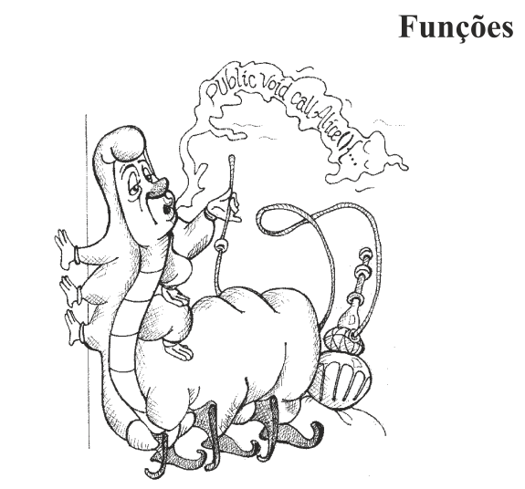

# ⚙️ Capítulo 3 — Funções

## 🎯 Objetivo da Aula

Aprender a escrever funções pequenas, claras e com responsabilidade única, facilitando leitura, manutenção e evolução do código.

---

## 🧠 Regra Principal

> **Funções devem ser pequenas.**

E mais importante ainda:

> **Funções devem fazer apenas uma coisa.**

---

## 📏 Funções Pequenas

Funções grandes são difíceis de:
- entender
- testar
- modificar

---

## 🔍 Exemplo Real

### ❌ Código ruim

~~~javascript
function processarPedido(pedido){
    let total = 0;

    for(let i = 0; i < pedido.itens.length; i++){
        total += pedido.itens[i].preco * pedido.itens[i].quantidade;
    }

    if(total > 100){
        total = total * 0.9;
    }

    console.log("Total:", total);

    return total;
}
~~~

---

### 🤯 Problemas:

- faz várias coisas:
  - calcula total
  - aplica desconto
  - imprime
- difícil reutilização
- difícil teste

---

## ✅ Refatoração

~~~javascript
function calcularTotal(pedido){
    return pedido.itens.reduce((total, item) => {
        return total + item.preco * item.quantidade;
    }, 0);
}

function aplicarDesconto(total){
    if(total > 100){
        return total * 0.9;
    }
    return total;
}

function exibirTotal(total){
    console.log("Total:", total);
}

function processarPedido(pedido){
    let total = calcularTotal(pedido);
    total = aplicarDesconto(total);
    exibirTotal(total);
    return total;
}
~~~

---

### 💡 Melhorias:

- funções com responsabilidade única
- nomes claros
- código reutilizável
- fácil de testar

---

## 🎓 Erro Clássico de Alunos

> “Mas professor, ficou maior…”

👉 Sim — mas ficou **muito mais legível**.

---

## 🧩 Faça apenas uma coisa

Uma função deve ter **uma única responsabilidade**.

---

### ❌ Exemplo

~~~javascript
function salvarUsuario(usuario){
    validarUsuario(usuario);
    salvarNoBanco(usuario);
    enviarEmail(usuario);
}
~~~

👉 Faz 3 coisas diferentes.

---

### ✅ Melhor

~~~javascript
function salvarUsuario(usuario){
    validarUsuario(usuario);
    persistirUsuario(usuario);
    notificarUsuario(usuario);
}
~~~

👉 Ainda orquestra, mas cada função faz uma coisa.

---

## 🧱 Um nível de abstração por função

Não misture níveis diferentes dentro da mesma função.

---

### ❌ Exemplo

~~~javascript
function gerarRelatorio(dados){
    console.log("Relatório:");

    for(let i = 0; i < dados.length; i++){
        console.log(dados[i].nome);
    }
}
~~~

👉 mistura:
- regra de negócio
- detalhe de implementação (loop)

---

### ✅ Melhor

~~~javascript
function gerarRelatorio(dados){
    imprimirCabecalho();
    imprimirItens(dados);
}

function imprimirItens(dados){
    dados.forEach(item => console.log(item.nome));
}
~~~

---

## 📖 Regra da leitura (de cima para baixo)

O código deve ser lido como uma história.

> Funções de alto nível chamam funções de baixo nível.

---

### 🧠 Exemplo

~~~javascript
function processarPagamento(pedido){
    validarPedido(pedido);
    let total = calcularTotal(pedido);
    cobrarPagamento(total);
}
~~~

👉 leitura natural:
- validar
- calcular
- cobrar

---

## 🔁 Evite repetição (DRY)

Duplicação é um dos maiores inimigos do código limpo.

---

### ❌ Exemplo

~~~javascript
function calcularAreaQuadrado(lado){
    return lado * lado;
}

function calcularAreaRetangulo(lado1, lado2){
    return lado1 * lado2;
}
~~~

👉 aqui ainda ok, mas cuidado com duplicações maiores

---

## ⚠️ Parâmetros de funções

### Regra geral:

> **Quanto menos parâmetros, melhor.**

---

### ❌ Exemplo

~~~javascript
function criarUsuario(nome, idade, email, telefone, endereco){
~~~

👉 difícil de usar e manter

---

### ✅ Melhor

~~~javascript
function criarUsuario(usuario){
~~~

---

## 🎓 Erro comum

### Uso excessivo de parâmetros booleanos

---

### ❌ Exemplo

~~~javascript
function gerarRelatorio(dados, mostrarDetalhes){
~~~

👉 comportamento muda baseado em flag

---

### ✅ Melhor

~~~javascript
function gerarRelatorioSimples(dados){
}

function gerarRelatorioDetalhado(dados){
}
~~~

---

## ⚠️ Efeitos colaterais

Funções não devem causar efeitos inesperados.

---

### ❌ Exemplo

~~~javascript
let total = 0;

function somar(valor){
    total += valor;
}
~~~

👉 altera estado externo

---

### ✅ Melhor

~~~javascript
function somar(totalAtual, valor){
    return totalAtual + valor;
}
~~~

---

## ⚖️ Separação comando-consulta

Funções devem:
- ou executar ação (comando)
- ou retornar valor (consulta)

👉 nunca os dois ao mesmo tempo

---

### ❌ Exemplo

~~~javascript
function adicionarItem(lista, item){
    lista.push(item);
    return lista.length;
}
~~~

---

### ✅ Melhor

~~~javascript
function adicionarItem(lista, item){
    lista.push(item);
}

function obterQuantidade(lista){
    return lista.length;
}
~~~

---

## 🚨 Tratamento de erros

Prefira exceções a códigos de erro.

---

### ❌ Exemplo

~~~javascript
function dividir(a, b){
    if(b == 0){
        return -1;
    }
    return a / b;
}
~~~

---

### ✅ Melhor

~~~javascript
function dividir(a, b){
    if(b === 0){
        throw new Error("Divisão por zero");
    }
    return a / b;
}
~~~

---

## 🔁 Evite funções com muitos níveis de indentação

---

### ❌ Exemplo

~~~javascript
function processar(lista){
    for(let i = 0; i < lista.length; i++){
        if(lista[i].ativo){
            if(lista[i].idade > 18){
                console.log(lista[i]);
            }
        }
    }
}
~~~

---

### ✅ Melhor

~~~javascript
function ehMaiorDeIdade(usuario){
    return usuario.idade > 18;
}

function processar(lista){
    lista
        .filter(usuario => usuario.ativo)
        .filter(ehMaiorDeIdade)
        .forEach(usuario => console.log(usuario));
}
~~~

---

## 🧪 Exercícios

### Exercício 1

Refatore:

~~~javascript id="n8z1qa"
function f(a){
    let r = 0;
    for(let i = 0; i < a.length; i++){
        r += a[i];
    }
    return r;
}
~~~

---

### Exercício 2

Melhore:

~~~javascript id="9g1r2b"
function p(x){
    if(x > 100){
        return true;
    } else {
        return false;
    }
}
~~~

---

### Exercício 3

Refatore:

~~~javascript id="t3k9lm"
function salvar(d){
    if(d != null){
        banco.salvar(d);
        console.log("Salvo");
    }
}
~~~

---

## 🚀 Conclusão

Funções bem escritas:

- são pequenas
- fazem uma única coisa
- têm nomes claros
- evitam efeitos colaterais
- são fáceis de ler e testar

> **Funções são a unidade fundamental da legibilidade do código.**

---

## 📚 Próximo Capítulo

👉 Comentários — quando usar (e principalmente quando NÃO usar)